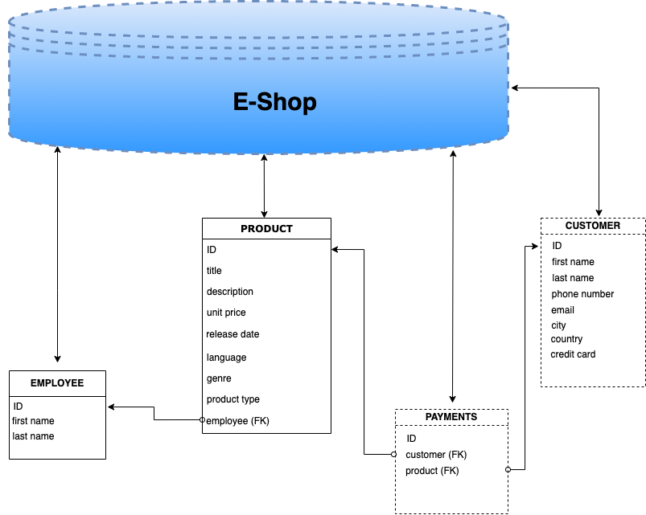

## Electronic Shop Database

In this task, I designed a database and implemented scripts for an online e-shop.
The e-shop sells music records, movies and books to customers.

The tasks implemented are:

1. The design of an [ER diagram](er-dagram/eshop-ER-diagram.pdf) with the appropriate relationships and cardinality for the above use case.
2. SQL [scripts](scripts/) and [database](scripts/Eshop%20database%20and%20tables%20creation.sql) for the ER diagram.
3. [Insert records](scripts/Data%20Insertion%20to%20Eshop%20Database.sql) for the desired data in each table of the database.
4. [SQL statements](scripts/Queries%20for%20database%20task.sql) for the following queries are provided:
   1. Extracts all the customers from a specific city.
   2. Searches for a product of a specific genre.
   3. Count how many customers are from a specific city.
   4. Calculate the average of the unit price.
   5. Extract all current orders.
   6. Extract all orders for books that has the keyword "the" in their description.
   7. Extract all payments with credit cards for music records.
   8. Count how many employees handle music records.
   9. Count how many employees first name is John.
   10. Count how many orders are in the system.

Consider the following use case specification:

- A customer submits orders for products
- A customer can place one order at a time
- An employee controls the products and is responsible for collecting the products for delivery
- The products are music records, movies, and books
- A customer can place an order using a credit card.
- The customer data includes: first name, last name, phone number, email, city, country
- The product data includes title, description, unit price, release data, language, genre and product type.

### Follow Me

- [LinkedIn](https://www.linkedin.com/in/olalekan-ganiyu-747855199/)
- [Twitter](https://twitter.com/GM_Olalekan)
- [Medium](https://gmolalekan.medium.com/)
- [Kaggle](https://www.kaggle.com/ganiyuolalekan)
- [Github](https://github.com/ganiyuolalekan)
- [Dev-Community](https://dev.to/ganiyuolalekan)

I will frequently release interesting articles on my [Medium page](https://gmolalekan.medium.com/) as well as on [dev-community](https://dev.to/ganiyuolalekan) as you can follow me to see what I'm up to, and leave a like (or a clap as the case may be) ☺.

On [Twitter](https://twitter.com/GM_Olalekan) and [LinkedIn](https://www.linkedin.com/in/olalekan-ganiyu-747855199/) though I keep frequent updates on what I am up-to or working on, and I try my best on [Kaggle](https://www.kaggle.com/ganiyuolalekan) as well.
